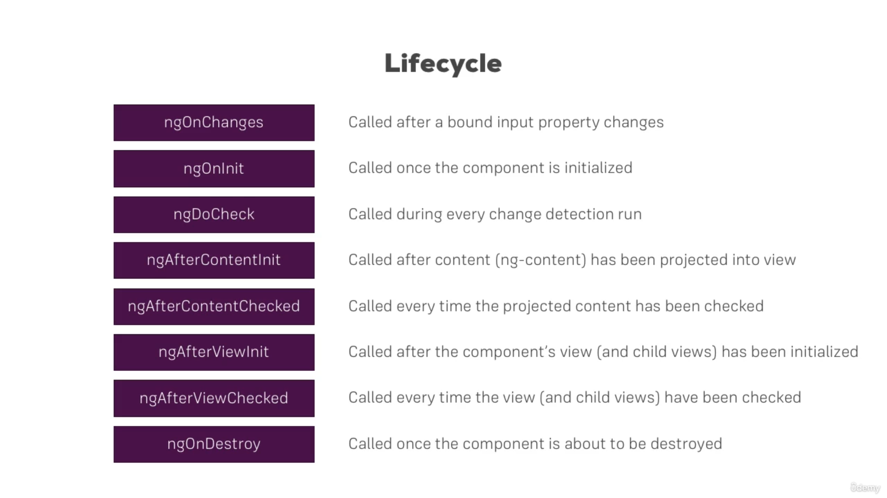

# angularUdemy
Angular course with typescript

## Start new angular app
```npx ng new <project-name> --no-strict```

### Components and Lifecycle
1. How components communicate with each other
2. Data-binding
3. How Lifecycle works

### 